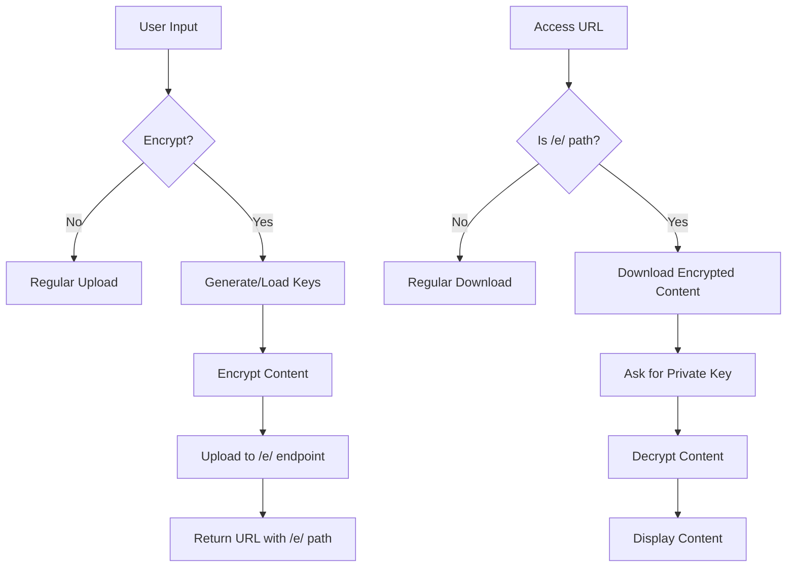
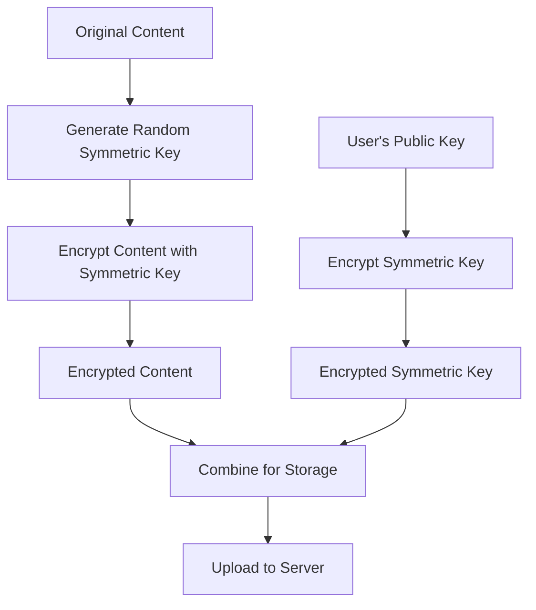
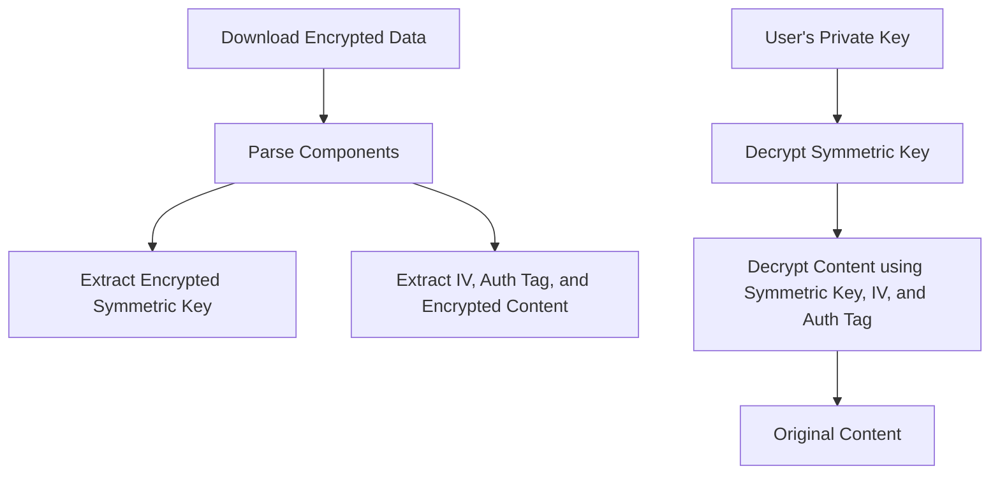

# Detailed Plan for Adding End-to-End Encryption to DedPaste

This document outlines a comprehensive plan for implementing end-to-end encryption in DedPaste. This plan ensures that encryption/decryption happens entirely on the client side, with the server having no knowledge of the encryption keys or plaintext content.

## 1. Overview of Changes



## 2. Detailed Implementation Plan

### 2.1. Server-Side Changes (src/index.ts)

1. **Add support for the `/e/{id}` path**:
   - Modify the URL path matching to recognize encrypted pastes
   - No changes to the storage mechanism (the server stores encrypted data as-is)
   - Update the CORS and OPTIONS handling to include the new path

2. **Update the upload handler**:
   - Add a new endpoint for encrypted pastes (`/e/upload` and `/e/temp`)
   - The server doesn't need to know if content is encrypted; it just stores the data
   - Update the URL generation to include the `/e/` path for encrypted pastes

### 2.2. CLI-Side Changes (cli/index.js)

1. **Add encryption options to the CLI**:
   - Add `--encrypt` flag to enable encryption
   - Add `--key-file` option to specify a private key file (default to SSH key)
   - Add `--gen-key` option to generate a new key pair

2. **Implement encryption functionality**:
   - Add crypto libraries for public/private key operations
   - Implement content encryption using the public key
   - Generate a symmetric key for the actual content encryption (for efficiency)
   - Encrypt the symmetric key with the public key

3. **Implement decryption functionality**:
   - Detect when accessing an encrypted paste
   - Prompt for the private key location if not provided
   - Decrypt the symmetric key using the private key
   - Decrypt the content using the symmetric key

4. **Key management**:
   - Add functions to generate key pairs
   - Add functions to load keys from files
   - Support using existing SSH keys
   - Implement secure key storage (optional)

### 2.3. Dependencies to Add

1. **Crypto libraries**:
   - `node:crypto` (built-in Node.js module)
   - `ssh-keygen` (optional, for generating SSH-compatible keys)

## 3. Technical Details

### 3.1. Encryption Approach



1. **Hybrid Encryption**:
   - Use asymmetric encryption (RSA) for key exchange
   - Use symmetric encryption (AES-256-GCM) for content encryption
   - This approach provides both security and efficiency

2. **Data Format**:
   - Encrypted symmetric key (base64 encoded)
   - Initialization vector (IV) for AES (base64 encoded)
   - Authentication tag for AES-GCM (base64 encoded)
   - Encrypted content (base64 encoded)
   - These components will be combined into a JSON structure

### 3.2. Decryption Process



### 3.3. Key Management

1. **Key Generation**:
   - Generate RSA key pair (2048 or 4096 bits)
   - Save private key securely (with optional passphrase)
   - Extract public key for encryption

2. **Using SSH Keys**:
   - Support loading existing SSH keys (typically from `~/.ssh/id_rsa`)
   - Convert SSH key format to the format needed for Node.js crypto operations

## 4. User Experience

### 4.1. Creating an Encrypted Paste

```
# Using generated keys
$ echo "secret data" | dedpaste --encrypt --gen-key

✓ Generated new key pair:
  - Private key: ~/.dedpaste/keys/private.pem
  - Public key: ~/.dedpaste/keys/public.pem

✓ Paste created successfully!
⚠️ This paste is encrypted and can only be decrypted with your private key

📋 https://paste.d3d.dev/e/AbCdEfGh

# Using existing SSH key
$ echo "secret data" | dedpaste --encrypt --key-file ~/.ssh/id_rsa.pub

✓ Paste created successfully!
⚠️ This paste is encrypted and can only be decrypted with your private key

📋 https://paste.d3d.dev/e/AbCdEfGh
```

### 4.2. Accessing an Encrypted Paste

```
$ dedpaste get https://paste.d3d.dev/e/AbCdEfGh

⚠️ This paste is encrypted
Enter path to private key [~/.dedpaste/keys/private.pem]: 

✓ Paste decrypted successfully:
secret data
```

## 5. Implementation Phases

### Phase 1: Server-Side Changes
1. Update the URL path handling in `src/index.ts`
2. Add support for the `/e/` path prefix
3. Update the URL generation for encrypted pastes
4. Deploy the updated server

### Phase 2: Basic Encryption in CLI
1. Add encryption flags to the CLI
2. Implement basic encryption/decryption functionality
3. Add key generation and management
4. Test with the updated server

### Phase 3: Enhanced Features
1. Add support for SSH keys
2. Improve error handling and user experience
3. Add documentation for encryption features
4. Comprehensive testing

## 6. Security Considerations

1. **No Server Involvement**:
   - The server never sees unencrypted content
   - The server never has access to encryption keys
   - All encryption/decryption happens client-side

2. **Key Security**:
   - Private keys should be stored securely
   - Consider adding passphrase protection for private keys
   - Warn users about the importance of key security

3. **Limitations**:
   - If a private key is lost, encrypted pastes cannot be recovered
   - The system doesn't provide key recovery mechanisms

## 7. Testing Strategy

1. **Unit Tests**:
   - Test encryption/decryption functions
   - Test key generation and loading
   - Test URL handling for encrypted pastes

2. **Integration Tests**:
   - Test end-to-end workflow with encryption
   - Test compatibility with existing unencrypted pastes
   - Test error handling and edge cases

3. **Security Tests**:
   - Verify that encrypted content cannot be decrypted without the correct key
   - Verify that the server cannot access unencrypted content

## 8. Documentation Updates

1. **README Updates**:
   - Add section on encryption features
   - Document key management
   - Provide examples of encrypted paste usage

2. **CLI Help Updates**:
   - Add help text for new encryption options
   - Provide examples in the help output