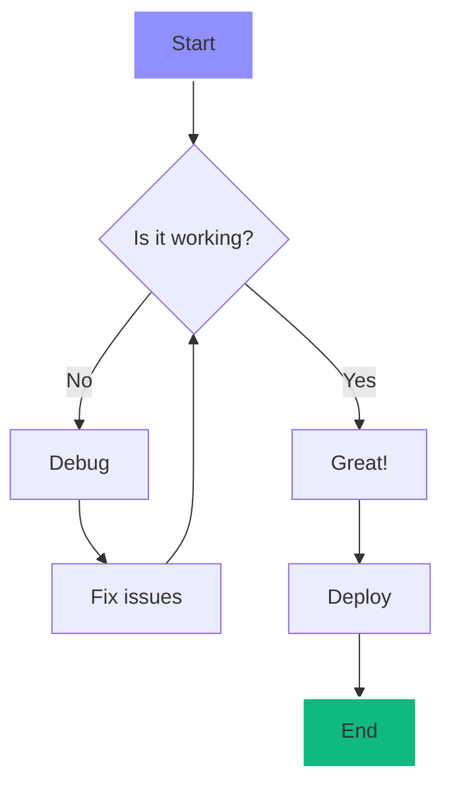
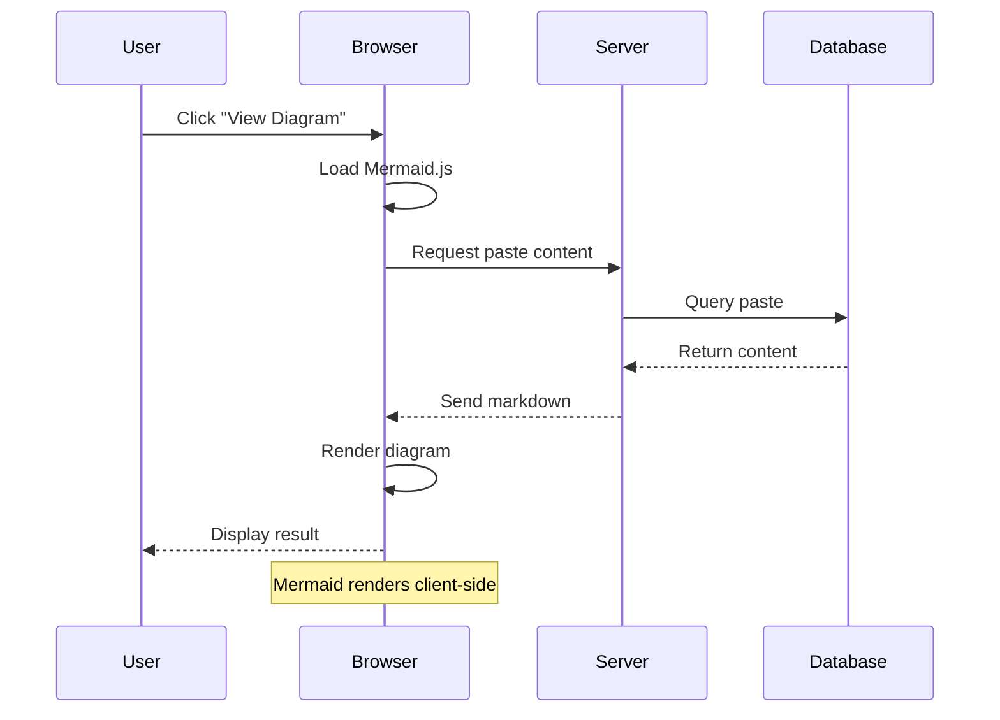
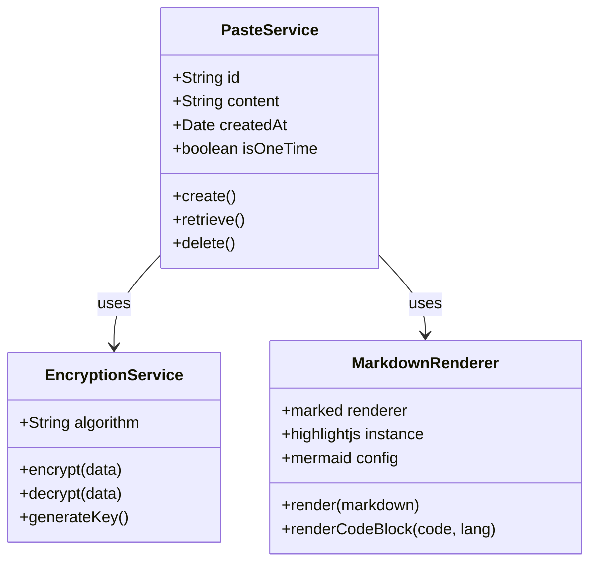
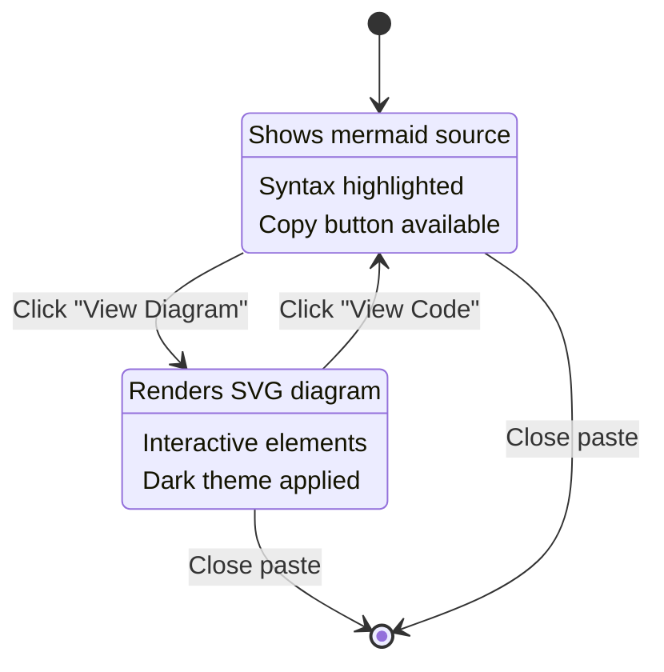
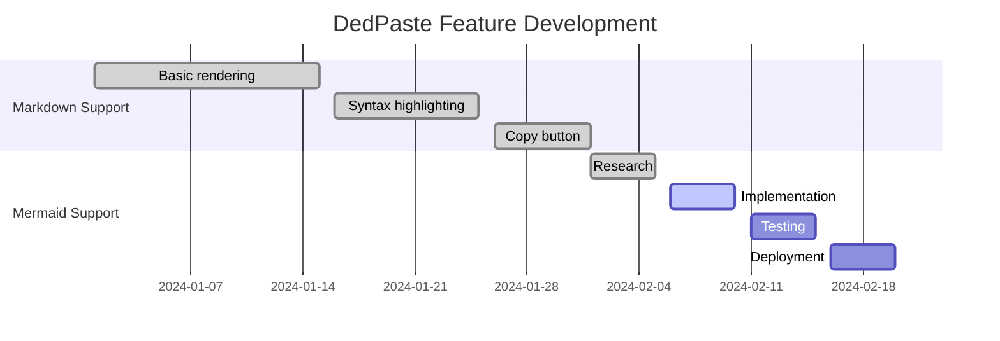
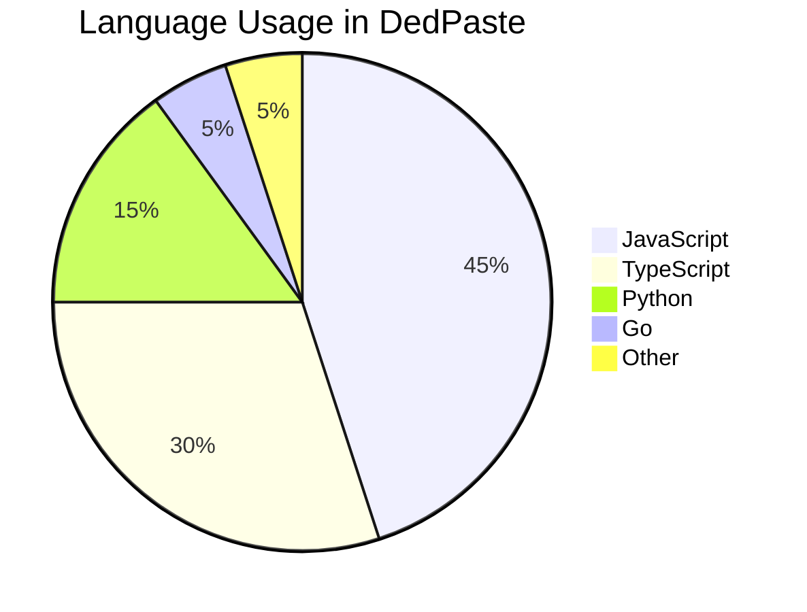
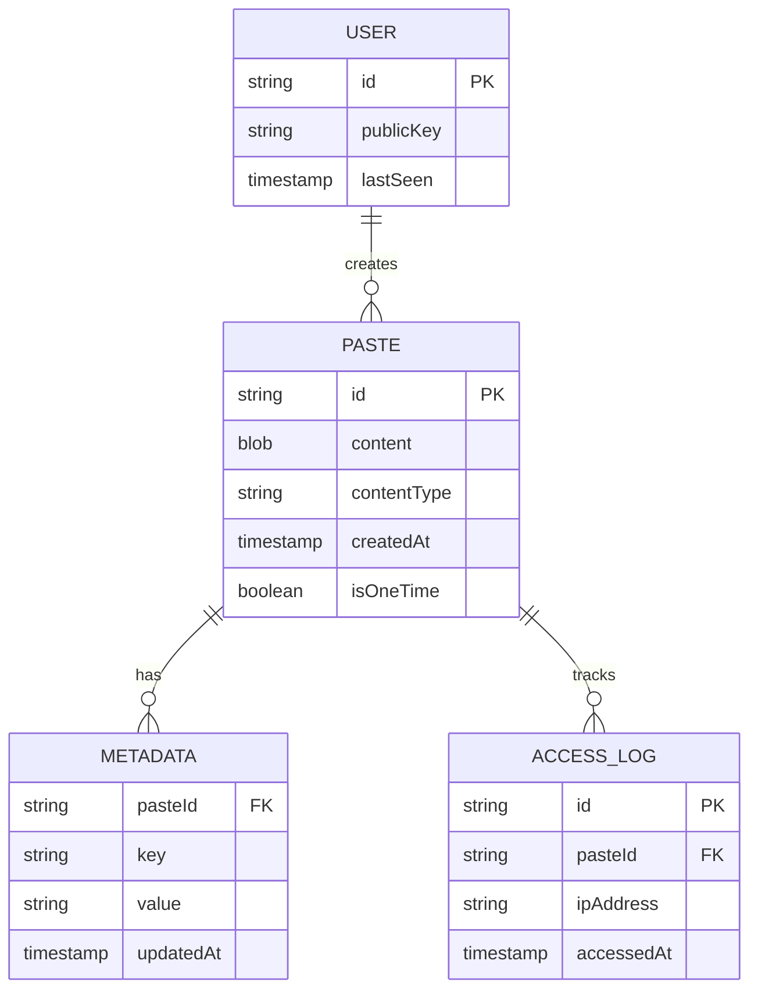
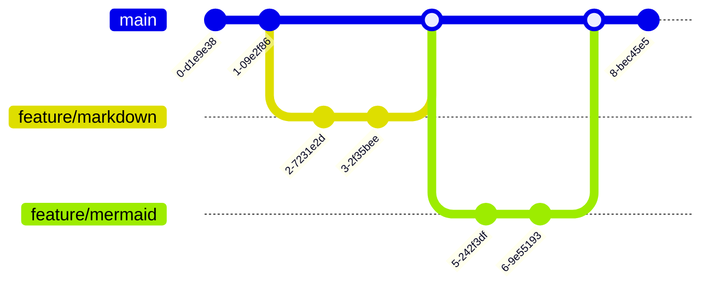
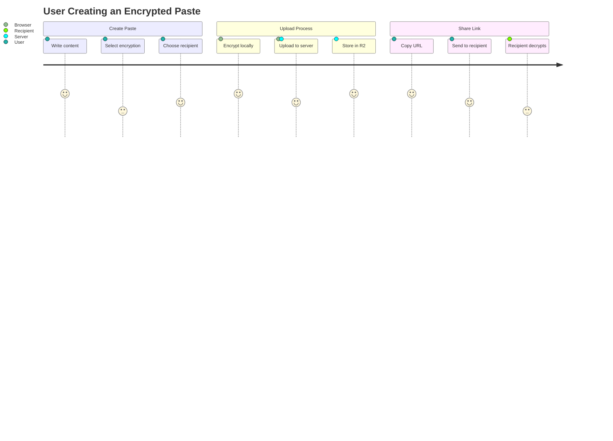
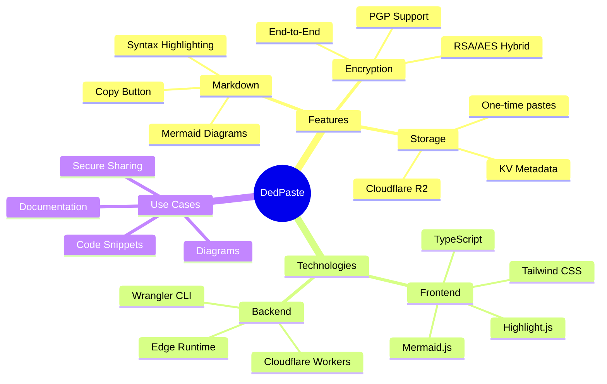

# Mermaid Diagram Test Document

This document tests Mermaid.js integration with various diagram types. Each diagram can be toggled between code view and rendered diagram view.

## Flowchart Example



## Sequence Diagram Example



## Class Diagram Example



## State Diagram Example



## Gantt Chart Example



## Pie Chart Example



## Entity Relationship Diagram



## Git Graph Example



## User Journey Example



## Mind Map Example (if supported)



## Regular Code Block (Non-Mermaid)

For comparison, here's a regular JavaScript code block that should still have syntax highlighting:

```javascript
// This is not a mermaid diagram
function renderMermaid(content) {
  const mermaidBlocks = content.match(/```mermaid([\s\S]*?)```/g);
  
  if (mermaidBlocks) {
    mermaidBlocks.forEach(block => {
      console.log('Found mermaid block:', block);
    });
  }
  
  return content;
}
```

## Testing Notes

1. Each Mermaid code block should have a "View Diagram" button
2. Clicking the button should render the diagram
3. The button should change to "View Code" when showing the diagram
4. Copy button should still work for copying the Mermaid source
5. Dark theme should be applied to all diagrams
6. Diagrams should be responsive and fit within the container